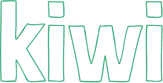

> A minimalistic in-memory key value store.

## Overview

You can think of Kiwi as thread safe global variables. This kind of library
comes in helpful when you need to manage state accross your application which
can be mutated with multiple threads. Kiwi protects your keys with mutex locks
so you don't have to.

Head over to [kiwi.sdslabs.co](https://kiwi.sdslabs.co) for more details and
documentation.

## Installation

> Kiwi requires [Go](https://golang.org/) >= 1.14

Kiwi can be integrated with your application just like any other go library.

```sh
go get -u github.com/sdslabs/kiwi
```

Now you can import kiwi any where in your code.

```go
import "github.com/sdslabs/kiwi"
```

## Basic usage

Create a store, add key and play with it. It's that easy!

```go
store := stdkiwi.NewStore()

if err := store.AddKey("my_string", "str"); err != nil {
  // handle error
}

myString := store.Str("my_string")

if err := myString.Update("Hello, World!"); err != nil {
  // handle error
}

str, err := myString.Get()
if err != nil {
  // handle error
}

fmt.Println(str) // Hello, World!
```

## Contributing

We are always open for contributions. If you find any feature missing, or just
want to report a bug, feel free to open an issue and/or submit a pull request
regarding the same.

<!-- TODO: Upate link once the contribution docs are complete -->
For more information on contribution, check out our [docs](https://kiwi.sdslabs.co/docs/).

## Contact

If you have a query regarding the product or just want to say hello then feel
free to visit [chat.sdslabs.co](https://chat.sdslabs.co) or drop a mail at
[contact@sdslabs.co.in](mailto:contact@sdslabs.co.in)

Made by [SDSLabs](https://sdslabs.co)
