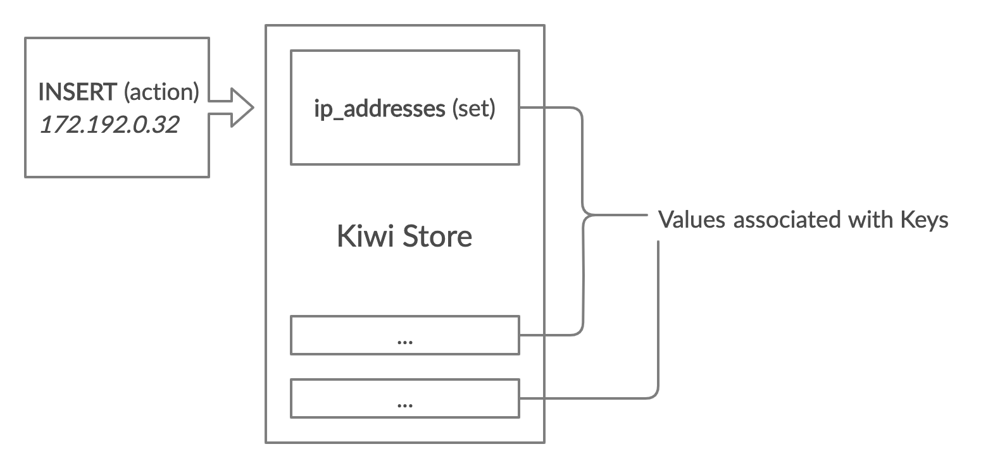

# Introduction

You can think of kiwi as thread safe global variables. This kind of library
comes in helpful when you need to manage state accross your application which
can be mutated with multiple threads. Kiwi protects your keys with mutex locks
so you don't have to.

Though the above paragraph gives a gist about what Kiwi is, it's much more
than just "global variables".

## How it works

Kiwi creates a `store` which can be thought of as the centralized repository
to access all your `key`s. A store is the entry-point for any `action` that
can take place on the `value` associated with the key.

Let's take an example to understand what we mean by above paragraph:

_Say, you have multiple servers with which your application interacts and you_
_need to store their IP addresses (which are dynamic). So essentially you need_
_a `set` of IP addresses where you can add or remove IP addresses._

For implementing the above example in Kiwi, you will create a `store`, add the
key `"ip_addresses"` with `value` of `set` type. To interact with the key, you
will invoke (or `Do`) an `action`, i.e., add IP address or remove IP address
in this case.

## Features

1. **Supports various types:** All values in Kiwi have a type. It is not restricted
   to a string value. So if you need to store a map, no need to store a JSON as
   a string. You can use the `hash` type.

2. **Extendable types:** Even though the core package comes with a limited number
   of data types (inspired by [Redis](https://redis.io/)), different data types can
   be implemented and integrated very easily with Kiwi. As an example, look at the
   [core value types](https://github.com/sdslabs/kiwi/tree/main/values). All these
   types are implemented assuming they are third-party value types.

3. **Go Package:** Kiwi was made with the motivation to be able to integrate it with
   a go application directly without any extra moving parts. Kiwi, with your application
   results in a single binary.

4. **JSON compatible:** Kiwi store and values are all JSON compatible, i.e., they can
   be converted into JSON or loaded from JSON. So in-case if you need to store some
   value in persistent storage or just backup your store in case of failure, you can
   do so in JSON format.

## When to use it

Kiwi helps in managing application state. If you're familiar with [Redux](https://redux.js.org/),
what Redux does for a react application, Kiwi does for an application written
in Golang.

The example in [How it works](./#how-it-works) section is a valid use-case for
using Kiwi in your application. When an application is divided into multiple
services, and it is horizontally scaled into multiple instances, you need to
keep a track of all the instances. This is where Kiwi comes in handy.

::: tip Did you know
Kiwi is a result of us trying to minimize moving parts in another application
we're developing. Want to know more about that project?
Read [this blog post](https://blog.sdslabs.co/2019/09/status-internal-hackathon).
:::
